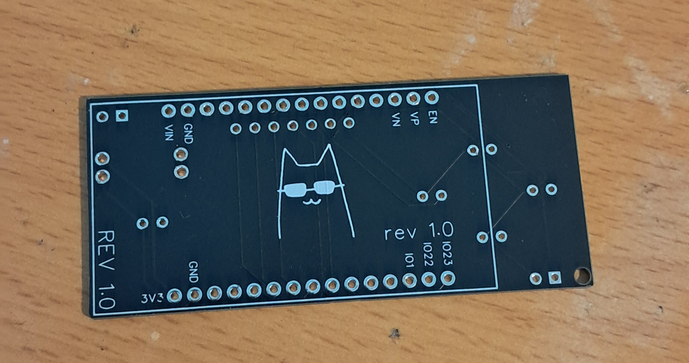
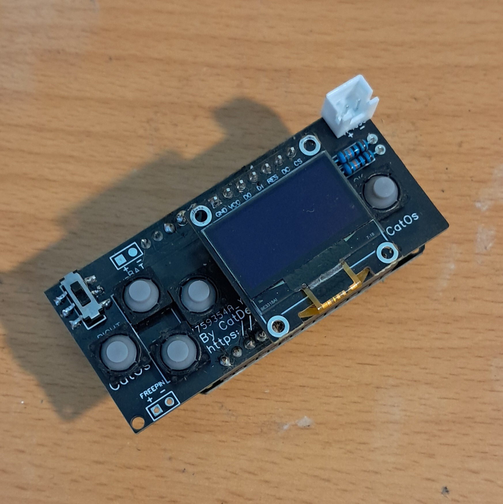
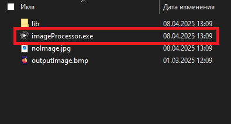
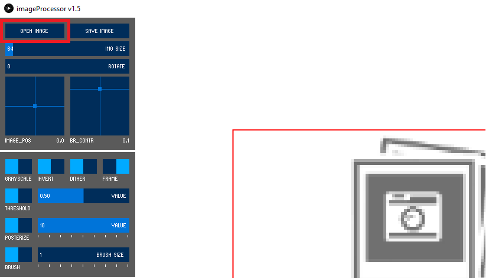
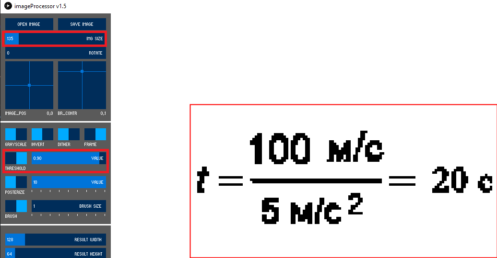

# CatOS Прошивка игровой консоли
| *> CatOs Pro <* | [CatOs Lite](https://github.com/CatDevCode/CatOs_Lite/) |
| --- | --- |


Прошивка для портативной игровой консоли на базе ESP32 с OLED-дисплеем. Включает набор игр, утилит и системных инструментов.

## Особенности
- 🕹️ Игры: Тетрис, Змейка, Flappy Bird, Ардуино дино, Понг
- ⚙️ Системные настройки через веб-интерфейс
- 📶 Поддержка WiFi (STA и AP режимы)
- 📖 Файловый менеджер для LittleFS
- 🛠️ Сервисное меню с калибровкой
- 🧮 Встроенный калькулятор
- ⏱️ Секундомер и таймер

## Компоненты
- Микроконтроллер ESP32
- OLED дисплей 128x64 (SPI, 7 pins)
- 5 кнопок управления
- Литий-ионный аккумулятор

## PCB
- Ссылка на проект [EasyEDA](https://oshwlab.com/oleggator2013/catos_catdevcode)




## Создание изображений и загрузка
1. Запустите [imageProcessor.exe](https://github.com/AlexGyver/imageProcessor) (установите java)



2. Откройте изображение



3. Настройте размер и порог изображения для получения лучшего результата



4. Сделайте инверсию цвета (белый цвет будет отображаться на экране). И убедитесь что Result height и Result width стоят также как на изображении


5. Сохраните файл нажав SAVE, в папке image-processor появится файл .h . Также можно переименовать этот файл.


## Библиотеки
- [GyverOled](https://github.com/GyverLibs/GyverOLED/)
- [GyverButton(Старое, но работает отлично)](https://github.com/GyverLibs/GyverButton)
- [GyverTimer(Старое, но для совместимости)](https://github.com/GyverLibs/GyverTimer)
- [Settings](https://github.com/GyverLibs/Settings)
- [Random16](https://github.com/GyverLibs/Random16)
- PS. Все библиотеки от гайвера

## Установка
1. Установите [PlatformIO](https://platformio.org/)
```bash
pip install platformio
```
2. Клонируйте репозиторий:
```bash
git clone https://github.com/CatDevCode/CatOs.git
```
3. Перейдите в папку с проектом:
```bash
cd CatOs
```
4. Сбилдите проект
```bash
pio run
```
5. Загрузите проект на ESP32
```bash
pio run --target upload 
```
## Кредиты
- Спасибо [Алексу Гайверу](https://github.com/GyverLibs/) за библиотеки ❤
- Спасибо проекту [MicroReader](https://github.com/Nich1con/microReader/) за некоторые функции и игры.
## Проект открыт для Pull-реквестов
## Сделано с любовью ❤
